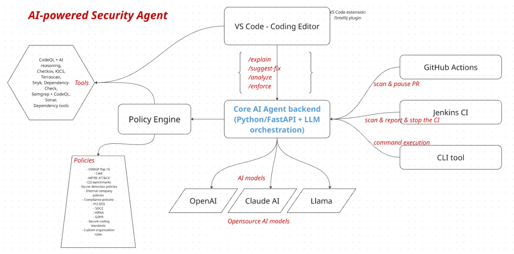

# Welcome to the AI Security Agent - VS Code extension

My plan is to build a system called AI-Powered Security Agent. It will scan for security issues, vulnerabilities, and CVEs in our code while developers are working in the VS Code IDE, as well as during GitHub pull requests, Jenkins CI builds, and CLI scans.

In the design, I will have a core AI backend that exposes APIs written in Python using FastAPI. This backend will call LLMs (such as OpenAI models) to analyze code, detect issues, suggest remediations, and enforce security policies. The core backend will support VS Code actions, GitHub Actions for PR triggers, CLI tools, and Jenkins build scripts.

I also plan to develop a VS Code extension that triggers local tools such as Semgrep and Gitleaks to identify OWASP Top 10 issues and other customizable company security rules and policies

[VS Code Extension - AI Sec Agent](https://github.com/vantypham/ai-security-agent) | [Core Backend Services](https://github.com/vantypham/ai-security-agent-backend-services)

## ARCHITECTURE
### Core AI backend (Python/FastAPI + LLM orchestration)
Acts as the central services for analysis and coordination.

### Multiple clients:
- VS Code extension (THIS) - VS Code Extension → local Semgrep/Gitleaks → send findings → FastAPI → OpenAI → remediation suggestions.
- GitHub Actions
- Jenkins pipeline
- CLI tool

### Policy Engine
- OWASP Top 10
- CWE
- MITRE ATT&CK
- CIS benchmarks
- Secret detection policies
- Internal company policies
- Compliance policies:
- PCI DSS
- SOC2
- HIPAA
- GDPR
- Secure coding standards:
Java,
Python,
Node.js,...
- Custom organization rules

### Scanners:
VS Code Extension
      ↓
Local scanners

- Semgrep
- Gitleaks
- Custom Policy Engine
- Compliance Engine
then,
Unified findings JSON
then,
AI Backend

### AI layer:
- Explains findings
- Provides remediation suggestions
- Performs enforcement and policy checks

## Needs
- Python 3.12.x/pip
- uv
- semgrep
- gitleaks
- fastapi
- uvicorn
- openai
- dotenv
- Node
- yo
- webpack
- vsce
- typescript
- axios

## Commands
uvicorn app.main:app
python -c "import fastapi; print(fastapi.__version__)"
uv pip install fastapi uvicorn openai python-dotenv
.\.venv\Scripts\activate  
uv venv 
uv sync 
vsce --version
vsce package
semgrep --version  
semgrep --config auto --json ./src > semgrep-scan2.json 
pip install semgrep 
npm run compile

## VS Code Extension

SAST
- Semgrep
- CodeQL
- SonarQube/SonarLint

Secrets
- Gitleaks
- TruffleHog

Dependencies
- Snyk
- Dependency-Check
- Dependency-Track

IaC / Config
- Checkov
- KICS
- Terrascan

AI reasoning
- FastAPI + LLM

Custom Policies

## Scanning strategy
Ctrl+S
then,
Fast local scan (<3 sec)

- Semgrep
- Gitleaks
- Custom rules
then,
Background scan

- CodeQL
- Dependency analysis
- Compliance checks
then,
PR / Jenkins full scan

- Everything

## License
This project is licensed under the MIT License - see the [LICENSE](LICENSE) file for details.

## 🔗 Links
- [VS Code Extension](https://marketplace.visualstudio.com/items)
- [OWASP 2025 Top 10](https://owasp.org/Top10/2025/)
